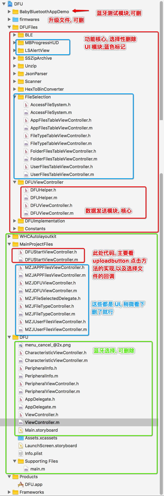

# DFUUpdate-OTA

##蓝牙设备升级

此版本是 OC 项目版本, 只是 demo, 个人留作学习使用, 并未做代码精简优化,如果有需要, 请自行优化.

如果是 swift 项目可以看 [IOS-Pods-DFU-Library](https://github.com/NordicSemiconductor/IOS-Pods-DFU-Library)

##感谢:

[iOS-Nordic-DFU-Demo](https://github.com/liushuangddu/iOS-Nordic-DFU-Demo)

[IOS-Pods-DFU-Library](https://github.com/NordicSemiconductor/IOS-Pods-DFU-Library)